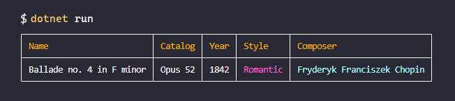

Outros idiomas: [en](./README.md)

  <h1>EF Core e Fluent Migrator (Exemplo)</h1>
  

## :book: Propósito
Uma aplicação de exemplo para mostrar como facilmente configurar um banco de dados com [EF Core](https://learn.microsoft.com/ef/core) e [Fluent Migrator](https://fluentmigrator.github.io).

## :package: Requisitos
- Certifique-se que você tenha o [.NET SDK versão 7](https://dotnet.microsoft.com).
- Certifique-se que você tenha o [docker e o docker compose](https://www.docker.com/get-started).

## :rocket: Executando o exemplo
- Inicie o banco de dados executando `docker compose up -d`.
- Navegue até o projeto de exemplo: `cd src/Sample`.
- Execute `dotnet run`.

## :memo: Notes
- Este exemplo usa PostgresSQL, mas pode ser facilmente adaptado para usar qualquer provedor de banco de dados.
